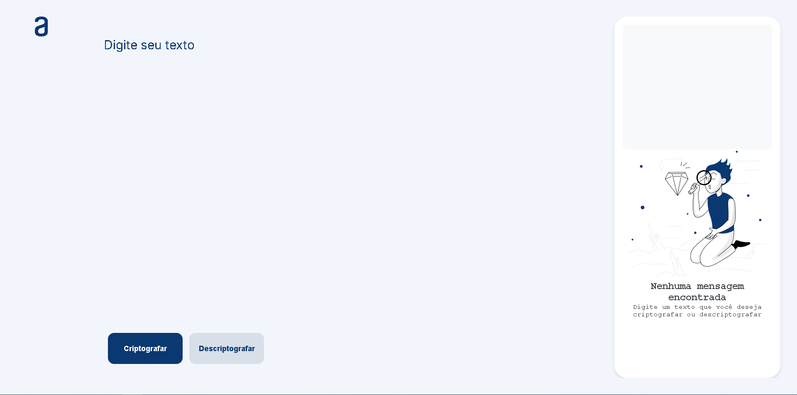
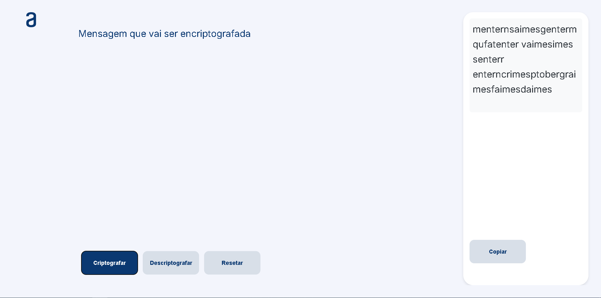

# Decodificador

Este é um projeto de decodificador desenvolvido para o curso One - Oracle Next Education. O aplicativo permite criptografar e descriptografar mensagens, proporcionando uma forma prática de aplicar conceitos de criptografia usando apenas HTML, CSS e JavaScript.

## Funcionalidades

- **Criptografia e Descriptografia**: Permite a criptografia e descriptografar de mensagens.
- **Interface Intuitiva**: Design simples e fácil de usar.
- **Responsivo**: Layout adaptado para diferentes tamanhos de tela, incluindo tablets e celulares.
- **Botão de Reset**: Um botão de reset foi adicionado para limpar as mensagens, tornando o uso mais dinâmico. Este botão aparece somente após a criptografia de uma mensagem.

## Tecnologias Utilizadas

- **HTML**
- **CSS**
- **JavaScript**

## Como Usar

1. **Criptografar**: Insira o texto no campo de entrada e clique no botão de criptografar.
2. **Descriptografar**: Insira o texto criptografado no campo de entrada e clique no botão de descriptografar.
3. **Copiar**: Use o botão de copiar para transferir o texto criptografado ou descriptografado para a área de transferência.
4. **Resetar**: Após criptografar uma mensagem, o botão de reset aparecerá para limpar as mensagens e começar novamente.

## Imagens do Projeto

Aqui estão algumas capturas de tela do projeto:

*Página principal*

*Mensagem Encriptografada*
